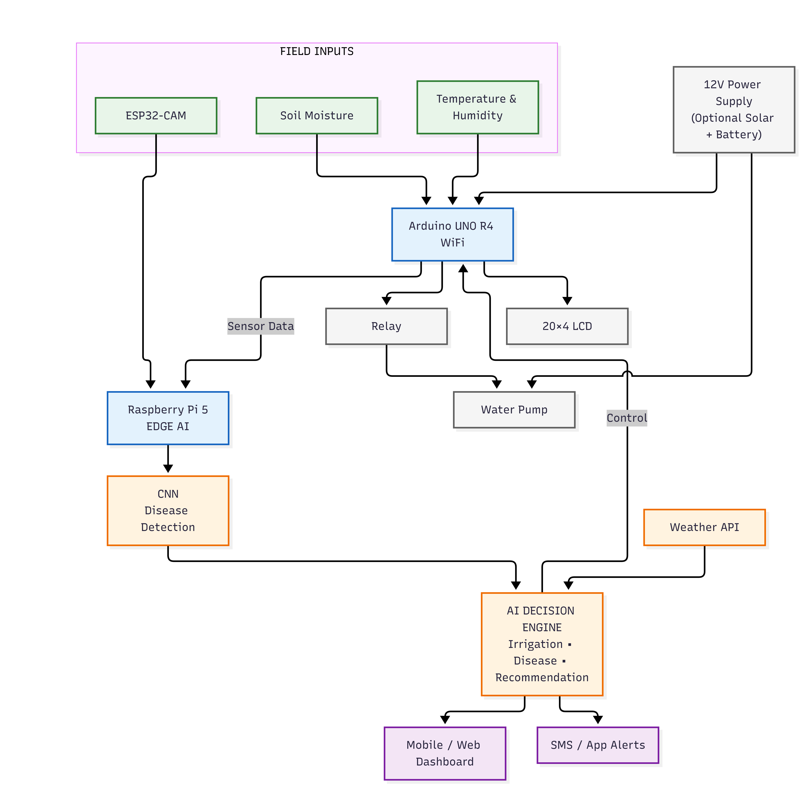

# Agri-Assist Edge 🌱

### AI-Powered Smart Irrigation & Crop Health Monitoring System

Agri-Assist Edge is an edge-AI agricultural monitoring and decision-support prototype that combines crop images, soil moisture, temperature and humidity to generate crop-health and irrigation decisions.

**Team POTHAR · Smart India Hackathon 2026 · Problem Statement SIH26180**

> **Status:** Under development. Hardware integration and AI deployment are in progress.

## System Architecture

<p align="center">
  
</p>

If the architecture image has a different filename in the current repository, either rename it to `architecture.png` or update the path above.

## What the system does

1. The **ESP32-CAM** captures crop/leaf images.
2. The **Arduino UNO R4 Minima** reads soil moisture, temperature and humidity and handles low-level pump control.
3. The **Raspberry Pi 5** receives image and sensor data.
4. The edge-AI pipeline performs image preprocessing and crop-health/disease inference.
5. The **Decision Engine** combines AI output and sensor conditions.
6. The Raspberry Pi sends a high-level pump command to the Arduino.
7. The Arduino drives the relay and water pump.
8. The LCD provides local feedback to the farmer.

## Repository structure

```text
Agri-Assist-Edge/
├── README.md
├── LICENSE
├── .gitignore
├── CONTRIBUTING.md
├── SECURITY.md
│
├── docs/
│   ├── architecture.md
│   ├── hardware.md
│   ├── ai-pipeline.md
│   ├── decision-engine.md
│   ├── testing.md
│   └── architecture.png          # add your existing architecture image
│
├── hardware/
│   ├── arduino/
│   │   ├── sensor_control.ino
│   │   └── README.md
│   └── esp32-cam/
│       ├── camera_capture.ino
│       └── README.md
│
├── ai/
│   ├── training/
│   │   └── README.md
│   ├── inference/
│   │   ├── inference.py
│   │   └── README.md
│   ├── models/
│   │   └── .gitkeep
│   └── dataset/
│       └── README.md
│
├── decision-engine/
│   ├── decision_engine.py
│   ├── irrigation.py
│   └── crop_health.py
│
├── backend/
│   ├── app.py
│   └── requirements.txt
│
└── config/
    └── example.env
```

## Hardware

| Component | Qty | Purpose | Approx. cost |
|---|---:|---|---:|
| Raspberry Pi 5 4GB | 1 | Edge AI and decision engine | ₹13,400 |
| Raspberry Pi AI HAT+ 13 TOPS *(optional)* | 1 | AI acceleration | ₹7,500 |
| Arduino UNO R4 Minima | 1 | Sensor and pump control | ₹2,300 |
| ESP32-CAM + OV2640 | 1 | Crop image capture | ₹750 |
| Capacitive soil-moisture sensor | 1 | Soil moisture | ₹120 |
| DHT22 | 1 | Temperature/humidity | ₹105 |
| 5V relay module | 1 | Pump switching | ₹45 |
| DC 3–6V mini pump | 1 | Irrigation | ₹50 |
| 20x4 I2C LCD | 1 | Local advisory | ₹335 |
| Supporting parts | - | Wires, breadboard, tubing, etc. | ₹1,500 |

**Estimated base prototype:** ~₹18,600  
**Estimated prototype with AI HAT+:** ~₹26,100

Prices are planning estimates, not quotations.

## Pin plan

| Device | Arduino connection |
|---|---|
| Soil moisture sensor | A0 |
| DHT22 | D2 |
| Relay | D7 |
| 20x4 I2C LCD | SDA/SCL |
| Raspberry Pi | USB serial |

The pin assignment is provisional and must be updated after final wiring.

## Software stack

- Python
- OpenCV
- NumPy
- PySerial
- TensorFlow Lite / compatible edge inference runtime
- Arduino C/C++
- ESP32 Arduino framework
- Flask for the local backend/API

## Running the decision engine

From the repository root:

```bash
python decision-engine/decision_engine.py
```

Example:

```bash
python decision-engine/decision_engine.py \
  --soil-moisture 680 \
  --temperature 29 \
  --humidity 70 \
  --disease-confidence 0.12 \
  --disease-class healthy
```

## Running the local backend

```bash
cd backend
python -m venv .venv
```

Windows:

```bash
.venv\Scripts\activate
```

Linux/Raspberry Pi:

```bash
source .venv/bin/activate
```

Then:

```bash
pip install -r requirements.txt
python app.py
```

The API starts on:

```text
http://127.0.0.1:5000
```

## Important power note

The water pump must **not** be powered from an Arduino GPIO pin. The Arduino controls the relay; the pump receives power from a separate, correctly rated supply.

A 3–6V pump must not be connected directly to a 12V adapter. If a 12V source is used, a suitable buck converter is required.

## AI model status

The repository contains the inference interface and decision-engine integration, but the final trained model is intentionally not included until the dataset, model architecture and validation results are finalized.

Do not claim a disease-detection accuracy in documentation until it has been measured on a held-out test set.

## Development status

| Module | Status |
|---|---|
| Component selection | ✅ |
| Soil-moisture sensing | 🔄 |
| DHT22 integration | 🔄 |
| Relay + pump control | 🔄 |
| LCD | 🔄 |
| ESP32-CAM capture | 🔄 |
| ESP32-CAM → Raspberry Pi | ⬜ |
| AI model training | ⬜ |
| Edge inference | ⬜ |
| Decision engine | 🟡 Prototype |
| Arduino ↔ Raspberry Pi | 🟡 Prototype |
| Full integration | ⬜ |
| Field testing | ⬜ |

## Disclaimer

Agri-Assist Edge is an academic/prototype system. AI predictions and irrigation decisions require field validation before being used for real agricultural operations.

## License

MIT License. See [LICENSE](LICENSE).
