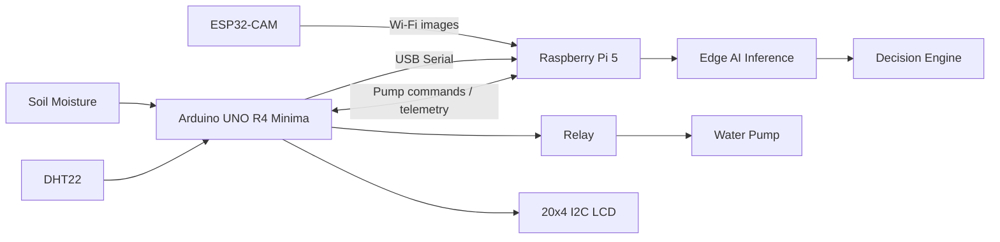

# System Architecture

Agri-Assist Edge uses a two-level control architecture.

## High-level flow

## Design principle

- **Arduino:** deterministic low-level sensing and actuation.
- **ESP32-CAM:** image acquisition.
- **Raspberry Pi:** computation, AI inference and high-level decisions.
- **Decision Engine:** combines environmental state with AI output.
- **Relay/pump:** physical irrigation actuator.
- **LCD:** local farmer feedback.

The final physical architecture is also provided as `architecture.png`.
